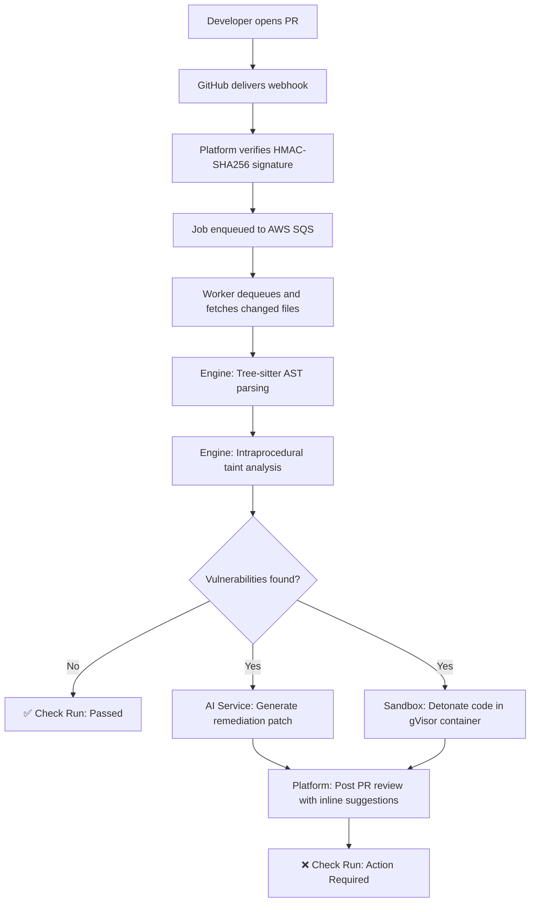
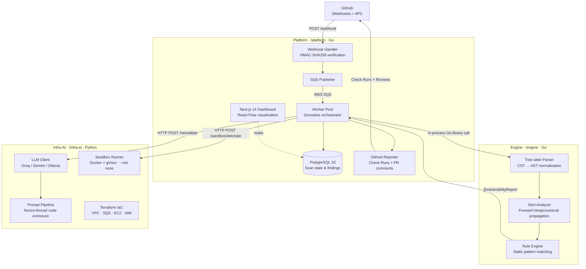

<div align="center">
  <h1>Lucid-CI</h1>
  <p><strong>AI-Native DevSecOps GitHub App</strong></p>
  <p>
    AST-based taint analysis · Sandboxed code detonation · AI-generated remediation patches
  </p>

  <br />

  <a href="#"></a>
  <a href="#"></a>
  <a href="#"></a>
  <a href="https://github.com/kleeeoss/project-lucid"></a>
</div>

---

> [!IMPORTANT]
> **Project Status: Pre-Alpha — Active Development**
>
> Lucid-CI is under active construction. The Platform ingestion layer and Infra-AI contract scaffolding are implemented; the core AST analysis engine and end-to-end pipeline are not yet functional. This README describes both the current implementation and the designed target architecture. Sections are clearly marked to distinguish what exists today from what is planned.

---

## What is Lucid-CI?

Lucid-CI is a GitHub App that intercepts pull requests, performs static security analysis using Abstract Syntax Tree (AST) taint tracing, detonates untrusted code in sandboxed containers, and generates AI-powered remediation patches delivered directly as inline PR suggestions.

It is designed to address a specific problem: AI-assisted coding tools (Copilot, Cursor, ChatGPT) generate code that compiles, passes linting, and appears functional — but frequently introduces injection vulnerabilities, hallucinated dependencies, hardcoded secrets, and insecure patterns that traditional regex-based scanners miss.

### How Lucid-CI is different

| Approach | Limitation |
|:--|:--|
| **Regex / pattern matching** (SonarQube) | High false-positive rates. Cannot trace data flow from user input to dangerous sink. |
| **Heavyweight query languages** (CodeQL) | Slow. Complex proprietary QL syntax. Not optimized for real-time PR feedback. |
| **Dependency-focused scanners** (Snyk) | Strong for known CVEs in packages. Weak on custom application-level logic. |
| **Lucid-CI** | Parses code into an AST, traces taint flow from untrusted sources to security-sensitive sinks, detonates code in gVisor-isolated containers, and generates structured remediation patches with architectural explanations. |

Lucid-CI does not replace comprehensive SAST platforms. It is purpose-built for real-time PR triage: fast enough to run on every push, precise enough to block genuine vulnerabilities, and developer-friendly enough that fixes are one click away.

---

## Development Status

Lucid-CI is a 3-person B.Tech capstone project with a 2-month delivery window. The system is being built across three isolated domains in a monorepo, each owned by a single developer. Current progress:

| Component | Owner | Phase | Status | What Exists |
|:--|:--|:--|:--|:--|
| **Engine** (`/engine`) | Apurv | — | 🔴 Not started | Directory placeholder only |
| **Platform** (`/platform`) | Krish | Phase 2 | 🟡 Core subsystems | Go module, HMAC-SHA256 webhook verification, SQS producer, GitHub App JWT auth & token caching, Check Runs client, worker goroutine pool, PostgreSQL store, data models |
| **Infra-AI** (`/infra-ai`) | Garv | Phase 1 | 🟡 Contracts & scaffolding | FastAPI service with mock endpoints, Pydantic V2 schemas (CTR-004–007), LLM client abstraction, Dockerfile, Terraform skeleton (VPC/SQS/EC2 modules), test suite |

> [!NOTE]
> The end-to-end pipeline is not yet operational. The Platform and Infra-AI components are being developed in isolation against mock interfaces and test fixtures. Integration, cloud deployment, the AST engine, the dashboard, and sandbox execution are planned for subsequent phases.

---

## Target Architecture

The following describes the **designed target system** that Lucid-CI is being built toward. Not all components shown below are implemented — see [Development Status](#development-status) for current state.

When a developer opens or updates a pull request on a connected repository, Lucid-CI is designed to execute the following pipeline:



**Key design principle:** CI/CD blocking is determined solely by the AST engine's vulnerability findings. If the AI remediation service fails or times out, the pipeline degrades gracefully — the vulnerability is still reported, but without an automated fix. AI failure never blocks or crashes CI.

### Component Architecture

Lucid-CI is organized as a monorepo with three isolated domains:



---

## What's Implemented

### Platform (`/platform`) — Phase 2 Complete

The Platform subsystem provides the ingestion, orchestration, and GitHub integration layers. Currently implemented:

- **Webhook security** — Constant-time HMAC-SHA256 signature verification using `crypto/subtle` to prevent timing side-channel attacks. Validates `X-Hub-Signature-256` headers against `GITHUB_WEBHOOK_SECRET`.
- **Webhook handler & router** — HTTP request handling for GitHub `pull_request` events with event type dispatching.
- **SQS producer** — Publishes scan task messages to AWS SQS for asynchronous processing.
- **GitHub App authentication** — RS256 JWT generation from the App's private key, Installation Access Token exchange and caching with thread-safe `sync.RWMutex` and proactive refresh.
- **Check Runs client** — Creates and updates GitHub Check Runs with line-level annotations and status reporting.
- **Worker goroutine pool** — Concurrent worker pool for dequeuing and processing scan jobs.
- **PostgreSQL store** — Database access layer using `pgxpool` connection pooling.
- **Data contracts** — Go struct definitions for GitHub PR webhook payloads (CTR-001), SQS scan task messages (CTR-002), and scan state models.

### Infra-AI (`/infra-ai`) — Phase 1 Complete

The AI and cloud infrastructure subsystem. Currently implemented:

- **FastAPI service** — Application skeleton with structured logging (`structlog`), CORS middleware, health check endpoint, and Pydantic validation error handling.
- **Mock API endpoints** — `POST /remediate` and `POST /sandbox/detonate` returning deterministic mock responses matching the contract schemas. These will be replaced with live LLM inference and Docker sandbox execution in Phase 2.
- **Pydantic V2 schemas** — Strict contract definitions with `extra="forbid"` for CTR-004 (RemediationRequest), CTR-005 (RemediationResponse), CTR-006 (SandboxRequest), CTR-007 (SandboxResult), plus supporting types (ASTNodeLocation).
- **LLM client abstraction** — Provider-agnostic base class with configuration for Groq (primary), Gemini (fallback), and Ollama (offline).
- **Configuration** — Settings module using `pydantic-settings` for environment-based configuration.
- **Dockerfile** — Containerized FastAPI service.
- **Terraform skeleton** — Modular IaC definitions for AWS VPC, SQS, EC2, and IAM, with variables, outputs, and provider versioning.
- **Test suite** — Unit tests for schema validation, service endpoints, and LLM client logic.

### Engine (`/engine`) — Not Started

The AST analysis engine has not been implemented. Only a `.gitkeep` placeholder exists. The planned implementation includes Tree-sitter Cgo bindings for AST parsing, intraprocedural taint analysis, and a static security rule engine. See [Planned: Engine Design](#planned-engine-design) below.

---

## Planned Capabilities

The following sections describe the **designed target architecture** for components that are not yet implemented or are only partially built. These are documented here as design intent, not as working functionality.

### Planned: Engine Design

The engine is designed as a **pure Go library** — no HTTP server, no network calls, no cloud dependencies. It will be imported directly into the Platform worker via Go workspaces (`go.work`), eliminating serialization overhead.

- **Tree-sitter parsing** via official Go Cgo bindings (`github.com/tree-sitter/go-tree-sitter`). Produces concrete syntax trees, then filters for named nodes to create a workable AST.
- **Intraprocedural taint analysis** using a forward worklist algorithm. Tracks untrusted user inputs (`Sources`) through variable assignments and string operations (`Propagators`) to security-sensitive function calls (`Sinks`). Recognized sanitization routines (parameterized queries, escape functions) clear taint.
- **Static rule engine** for vulnerabilities that don't require data-flow tracing: hardcoded secrets (entropy + pattern), `eval()`/`exec()` usage, OS command injection.
- **Confidence scoring** (0.0–1.0) based on taint path directness, with configurable reporting thresholds.

**Target language support:** JavaScript (P0), Python (P0), Go (P1), TypeScript (P2).

**Target vulnerability coverage:**

| Rule ID | Vulnerability | CWE | Detection Method |
|:--|:--|:--|:--|
| `LUCID-SEC-001` | SQL Injection | CWE-89 | Taint analysis (source → sink) |
| `LUCID-SEC-002` | OS Command Injection | CWE-78 | Taint analysis + AST pattern |
| `LUCID-SEC-003` | Hardcoded Secrets | CWE-798 | Entropy scoring + pattern match |
| `LUCID-SEC-004` | Path Traversal | CWE-22 | Taint analysis (source → sink) |
| `LUCID-SEC-005` | Dangerous Dynamic Execution | CWE-95 | AST pattern match (`eval`, `exec`) |

**Honest scope limitations:** The taint analysis is intraprocedural (single function scope). It will not perform interprocedural analysis, type resolution, control-flow graph construction, or pointer/alias analysis. These are deliberate V1 scoping decisions — the engine is designed for precision within its declared scope rather than aspirational coverage it cannot deliver.

### Planned: Dynamic Sandbox

Untrusted PR code will be executed in ephemeral containers using Docker-on-EC2 with gVisor (`runsc`) as the userspace kernel, enforcing complete isolation. The sandbox API endpoint (`POST /sandbox/detonate`) is currently a mock. The planned implementation includes:

- Network isolation (`--network none`)
- Read-only root filesystem with 64MB tmpfs
- Memory/CPU/PID limits (512MB, 0.5 CPU, 100 PIDs)
- `--cap-drop ALL` and unprivileged execution (UID 10001)
- 60-second hard kill watchdog
- Fresh container per scan with immediate cleanup

### Planned: AI Remediation

The `POST /remediate` endpoint currently returns mock responses. The planned live implementation will:

- Invoke Groq `llama-3.1-8b-instant` (primary) or Gemini 1.5 Flash (fallback) via the provider-agnostic `LLMClient` abstraction
- Use cryptographic nonce fencing to defend against prompt injection from malicious PR code
- Strip code comments via AST before prompt assembly
- Validate all LLM outputs against Pydantic schemas with up to 3 corrective retries
- Present patches as PR review suggestions requiring explicit developer acceptance (never auto-apply)

### Planned: Dashboard & Visualization

A Next.js 14 admin dashboard with React Flow AST taint graph visualization is planned for Phase 5. It is not yet implemented.

---

## Security Model

Lucid-CI processes untrusted code, holds GitHub credentials, and feeds user-controlled content to language models. The security architecture is designed around five trust boundaries:

### Webhook Verification (Implemented)

The Platform webhook handler validates `X-Hub-Signature-256` using constant-time HMAC-SHA256 comparison (`crypto/subtle.ConstantTimeCompare`), preventing both spoofed webhooks and timing side-channel attacks.

### Credential Hygiene (Implemented)

- GitHub App private key and all secrets loaded exclusively from environment variables
- Installation Access Tokens are short-lived (1-hour TTL), cached in memory with thread-safe locking, never logged or persisted
- SQS messages carry metadata only — never source code, tokens, or credentials

### Sandbox Isolation (Planned — 12 controls)

| Control | Implementation |
|:--|:--|
| Network isolation | `--network none` — no egress, no C2, no data exfiltration |
| Read-only root filesystem | `--read-only` |
| Ephemeral writable storage | `--tmpfs /tmp:rw,size=64m` |
| Memory limit | `--memory 512m` (OOM-killed at boundary) |
| CPU limit | `--cpus 0.5` |
| Process limit | `--pids-limit 100` (fork bomb defense) |
| Userspace kernel | `--runtime=runsc` (gVisor syscall interception) |
| Execution timeout | 60-second hard kill watchdog |
| Privilege restrictions | Never `--privileged` |
| Capabilities dropped | `--cap-drop ALL` |
| Read-only code mount | Source volume mounted `:ro` |
| Lifecycle cleanup | Fresh container per scan; host temp directory destroyed immediately |

### Prompt Injection Defense (Planned)

1. **Nonce delimitation:** Untrusted code enclosed in XML tags with random UUID nonces.
2. **Comment stripping:** Code comments removed via AST before prompt assembly.
3. **Schema enforcement:** All LLM outputs validated against Pydantic schemas.
4. **Human review gate:** AI-generated patches are **never** auto-applied. They are presented as PR review suggestions requiring explicit developer acceptance.

---

## Technology Stack

| Layer | Technology | Status |
|:--|:--|:--|
| **Platform API** | Go 1.23+ | ✅ Implemented |
| **Webhook Security** | `crypto/hmac` + `crypto/subtle` | ✅ Implemented |
| **GitHub App Auth** | RS256 JWT (`golang-jwt/jwt/v5`) | ✅ Implemented |
| **Queue** | AWS SQS (Standard) | ✅ Producer implemented |
| **Database** | PostgreSQL 16 (`pgxpool`) | ✅ Store layer implemented |
| **AI Service** | Python 3.11+, FastAPI, Uvicorn | ✅ Mock endpoints |
| **AI Contracts** | Pydantic V2 | ✅ Schemas defined |
| **Infrastructure** | Terraform (AWS VPC, SQS, EC2, IAM) | ✅ Skeleton defined |
| **AST Parsing** | Tree-sitter (Cgo bindings) | 🔴 Not started |
| **Taint Engine** | Go (worklist algorithm) | 🔴 Not started |
| **Sandbox** | Docker + gVisor (`runsc`) | 🔴 Not started |
| **LLM Integration** | Groq / Gemini / Ollama | 🟡 Abstraction only |
| **Dashboard** | Next.js 14, React Flow, TailwindCSS | 🔴 Not started |
| **Reverse Proxy** | Caddy | 🔴 Not started |

---

## Repository Structure

The current repository structure as of the latest commit:

```
project-lucid/
├── .editorconfig
├── .gitignore
├── .github/
│   └── workflows/
│       └── repo-backup.yml
├── go.work                           # Go multi-module workspace
├── go.work.sum
├── README.md
│
├── engine/                           # Apurv — Core Systems & DSA
│   └── .gitkeep                      #   (not yet implemented)
│
├── platform/                         # Krish — Platform & Full-Stack
│   ├── go.mod
│   ├── go.sum
│   ├── ingestion/
│   │   ├── handler.go                #   Webhook event handler & dispatcher
│   │   ├── router.go                 #   HTTP router (/healthz, /webhook)
│   │   ├── security.go               #   HMAC-SHA256 signature verification
│   │   ├── security_test.go
│   │   └── sqs_producer.go           #   SQS task publisher
│   ├── github/
│   │   ├── auth.go                   #   RS256 JWT & installation token manager
│   │   ├── auth_test.go
│   │   ├── check_runs.go             #   Check Runs creation & line annotations
│   │   └── check_runs_test.go
│   ├── worker/
│   │   ├── pool.go                   #   Goroutine worker pool
│   │   └── pool_test.go
│   ├── db/
│   │   └── store.go                  #   PostgreSQL pgxpool data access layer
│   └── models/
│       ├── github_pr.go              #   CTR-001: Webhook PR event models
│       ├── sqs_message.go            #   CTR-002: SQS scan task message models
│       ├── scan.go                   #   Scan state & domain models
│       └── contracts_test.go
│
└── infra-ai/                         # Garv — AI & Cloud Architect
    ├── Dockerfile
    ├── requirements.txt
    ├── pytest.ini
    ├── README.md
    ├── service/
    │   ├── main.py                   #   FastAPI application entry point
    │   ├── routes.py                 #   /healthz, /remediate (mock), /sandbox/detonate (mock)
    │   ├── llm_client.py             #   Provider-agnostic LLM client abstraction
    │   └── config.py                 #   pydantic-settings configuration
    ├── models/
    │   ├── schemas.py                #   Pydantic V2 schemas (CTR-004 through CTR-007)
    │   └── mock_payloads.py          #   Synthetic test payloads
    ├── prompts/                      #   (placeholder — nonce prompt templates planned)
    ├── sandbox/                      #   (placeholder — Docker orchestrator planned)
    ├── tests/
    │   ├── test_schemas.py           #   Schema validation tests
    │   ├── test_service.py           #   Endpoint integration tests
    │   └── test_llm_client.py        #   LLM client tests
    └── terraform/
        ├── main.tf                   #   Root module (VPC, SQS, EC2)
        ├── variables.tf
        ├── outputs.tf
        └── versions.tf              #   Terraform >= 1.9, AWS Provider ~> 5.50
```

---

## Performance Targets

These are design targets from the engineering specification — not measured benchmarks:

| Operation | Target | Notes |
|:--|:--|:--|
| Webhook response | < 300ms | HMAC verify + SQS enqueue; well under GitHub's 10s limit |
| AST parsing (per file) | < 50ms | Tree-sitter Cgo efficiency |
| Taint analysis (per file) | < 500ms | Intraprocedural AST walk |
| Engine total (50 files) | < 30s | Parallelized across CPU cores |
| Sandbox execution | 10–60s | Dominated by dependency installation |
| AI remediation (per vuln) | 5–15s | Hosted LLM API inference |
| **Full pipeline (20 files, 2 vulns)** | **< 120s** | **Target developer CI wait time** |

---

## Team

| Engineer | Role | Domain |
|:--|:--|:--|
| **Apurv** | Core Systems & DSA Specialist | Engine — AST parsing, taint analysis, rule engine |
| **Krish** | Platform & Full-Stack Engineer | Platform — Webhooks, orchestration, persistence, dashboard |
| **Garv** | AI & Cloud Architect | Infra-AI — LLM pipeline, sandbox, Terraform IaC |

---

## Documentation

Detailed engineering documentation is maintained separately from this README:

| Document | Scope |
|:--|:--|
| **Master Documentation (Parts 1–6)** | Architecture, requirements, security model, data contracts, threat model, performance budgets, testing strategy, deployment, IaC, risk register, decision log |
| **Engineering Sprint Master** | 5-phase implementation schedule, gate criteria, contract freeze protocol |
| **Developer Sprint Plans** | Per-engineer task breakdowns with acceptance criteria and verification procedures |
| **Pre-Implementation Audit** | Cross-document consistency verification and contradiction resolution matrix |

---

## Contributing

Lucid-CI follows a contracts-first development methodology. Before implementing any feature that crosses domain boundaries, the relevant data contracts must be defined, reviewed, and frozen by all team members.

- **Branch naming:** `apurv/feature-engine-*`, `krish/feature-plat-*`, `garv/feature-infra-*`
- **Commit convention:** `feat(engine): ...`, `fix(platform): ...`, `chore(infra-ai): ...`
- **PR requirements:** 1 peer review + all CI checks passing before merge to `main`

---

## License

*License to be determined.*

---

<div align="center">
  <sub>Built with Tree-sitter, gVisor, and a healthy distrust of AI-generated code.</sub>
</div>
